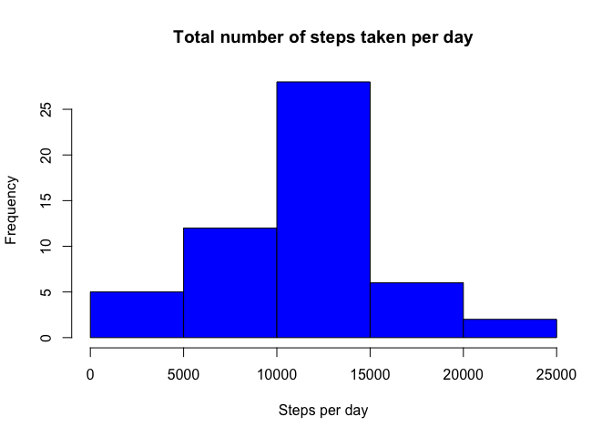
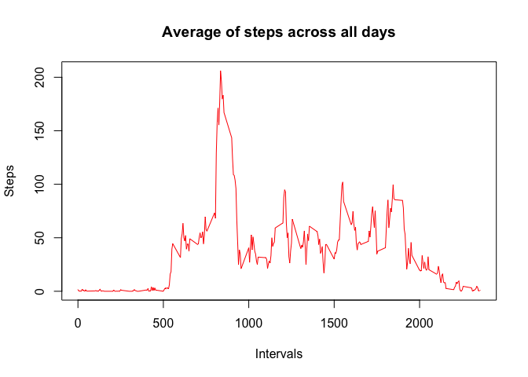
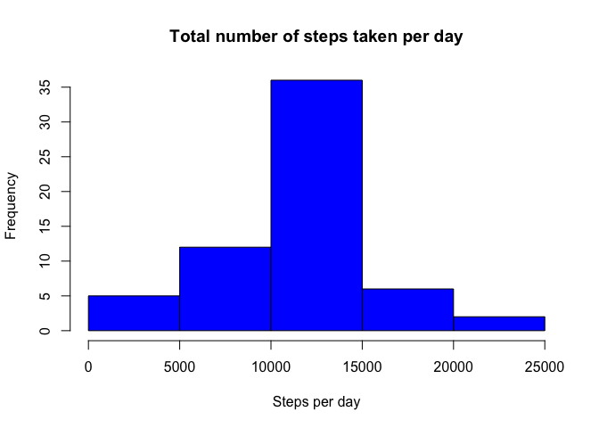

## Loading and preprocessing the data

```r
data <- read.csv("activity.csv", na.strings = "NA")
data$date <- as.Date(data$date, "%Y-%m-%d")
```

## What is mean total number of steps taken per day?

```r
cdata <- data[!is.na(data$steps), ]
totalSteps <- aggregate(steps ~ date, data = cdata, sum)
hist(totalSteps$steps, col = "blue", main = "Total number of steps taken per day", xlab = "Steps per day")
```

<!-- -->

```r
meanSteps <- mean(totalSteps$steps)
medianSteps <- median(totalSteps$steps)
```
- Mean of total number of steps taken per day is 1.0766189\times 10^{4}, median of total number of steps taken per day is 10765.

## What is the average daily activity pattern?

```r
avgSteps <- aggregate(steps ~ interval, data = cdata, mean)
plot(avgSteps$interval, avgSteps$steps, type = "l", col = "red", main = "Average of steps across all days", xlab = "Intervals", ylab = "Steps")
```

<!-- -->

```r
maxIndex <- which.max(avgSteps$steps)
interval <- avgSteps[maxIndex, "interval"]
```
- On average across all the days in the dataset, interval 835 contains the maximum number of steps.

## Imputing missing values

```r
missingNAs <- sum(is.na(data$steps))
# Using mean of steps in day to fill the missing values
index <- is.na(data$steps)
na <- data[index, ]
filled <- sapply(na$interval, function(x) { avgSteps[avgSteps$interval==x, 2]})
newdata <- data
newdata[index, "steps"] <- filled

totalSteps <- aggregate(steps ~ date, data = newdata, sum)
hist(totalSteps$steps, col = "blue", main = "Total number of steps taken per day", xlab = "Steps per day")
```

<!-- -->

```r
meanSteps <- mean(totalSteps$steps)
medianSteps <- median(totalSteps$steps)
```
- Mean of total number of steps taken per day is 1.0766189\times 10^{4}, median of total number of steps taken per day is 1.0766189\times 10^{4}.

## Are there differences in activity patterns between weekdays and weekends?

```r
newdata["group"] <- sapply(newdata$date, function(x) { if (weekdays(x) %in% c("Sunday", "Saturday")) { "weekend"} else { "weekday"}})

newdata$group <- factor(newdata$group)

avgSteps <- aggregate(steps ~ interval + group, mean, data = newdata)
library(lattice)
xyplot( steps ~ interval | group, data = avgSteps, type="l", layout=c(1,2), xlab="Interval", ylab="Number of steps")
```

<!-- -->
